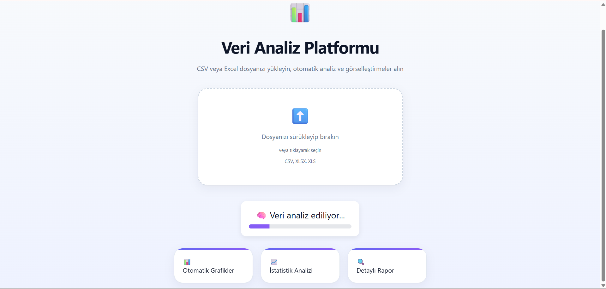
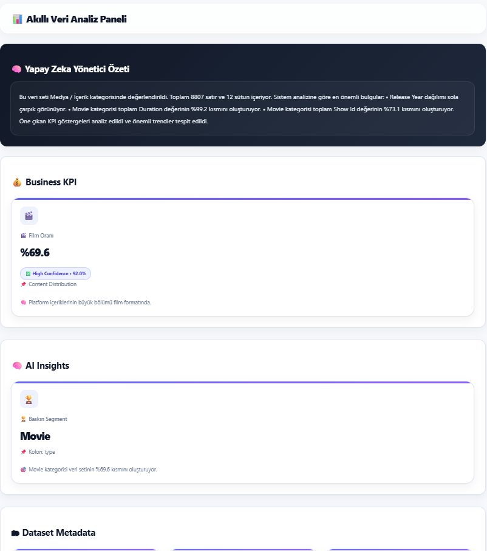
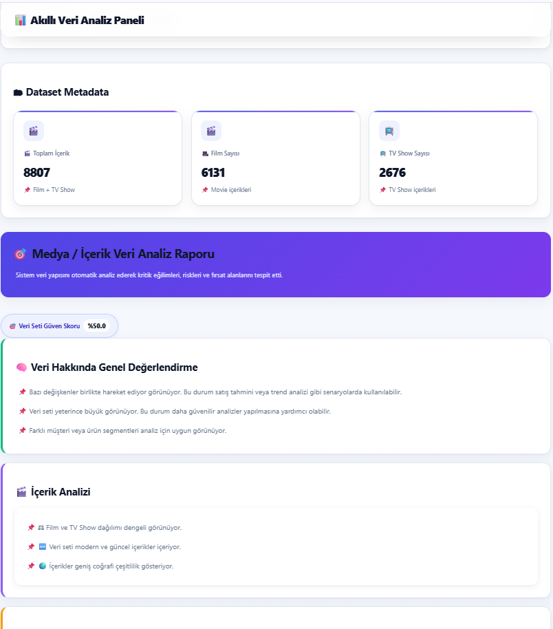
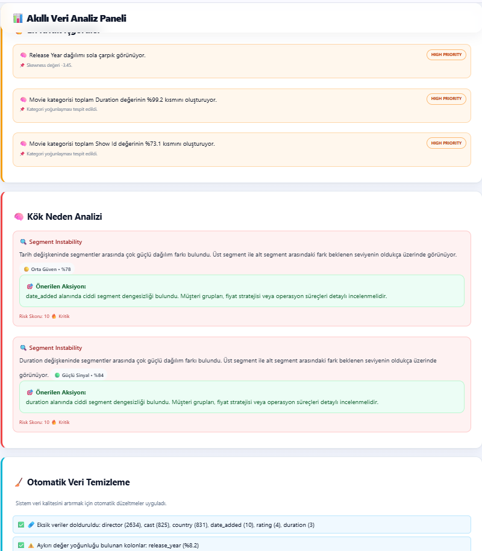
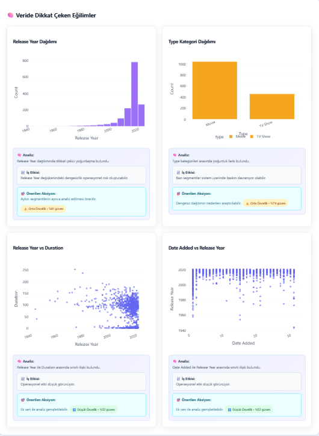
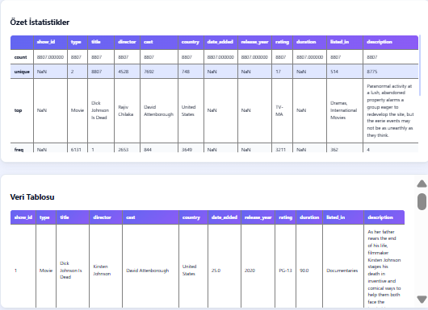

# Akıllı Veri Platformu

Yapay zeka destekli otomatik veri analiz ve görselleştirme platformu.

## Proje Hakkında

Bu proje, kullanıcıların yüklediği veri setlerini otomatik olarak analiz eden ve veri tipine göre akıllı KPI, grafik ve içgörüler üreten bir veri analiz platformudur.

Sistem:
- CSV ve Excel dosyalarını analiz eder
- Veri tipini otomatik algılar
- KPI üretir
- Grafik oluşturur
- Anomali tespiti yapar
- İçgörü ve yorum üretir

## Özellikler

- Otomatik veri analizi
- Akıllı KPI sistemi
- Dinamik dashboard yapısı
- Plotly destekli interaktif grafikler
- Veri temizleme sistemi
- İçgörü motoru
- Executive summary üretimi
- Anomali analizi

## Kullanılan Teknolojiler

- Python
- Flask
- Pandas
- NumPy
- Plotly
- Openpyxl

## Kurulum

bash
pip install -r requirements.txt

## Çalıştırma

bash
python -m flask run

## Gelecek Planları

Yapay zeka destekli veri yorumlama geliştirmeleri
Daha gelişmiş dashboard sistemi
Gerçek zamanlı analiz
Otomatik rapor üretimi
Kullanıcı bazlı öneri sistemi

## Ekran Görüntüleri

## Geliştirici
Emine Elmas
